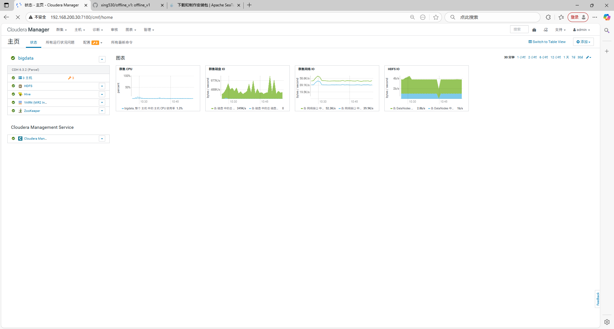
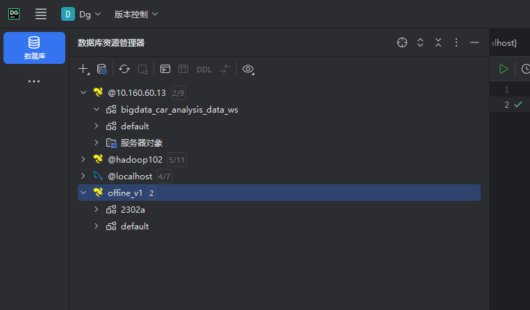
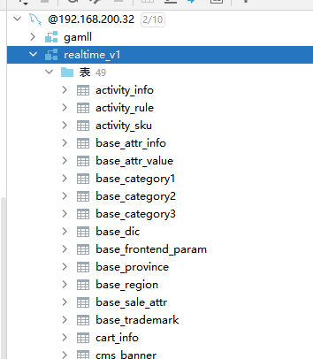
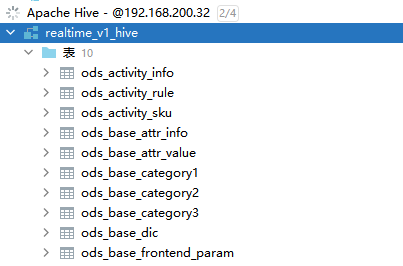
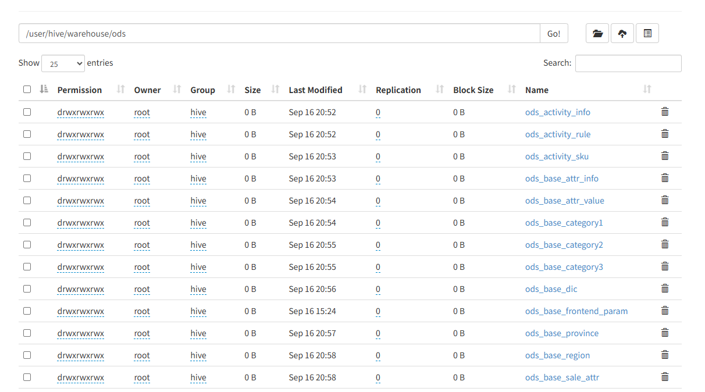
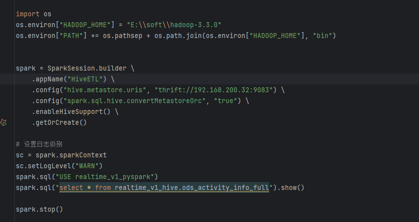
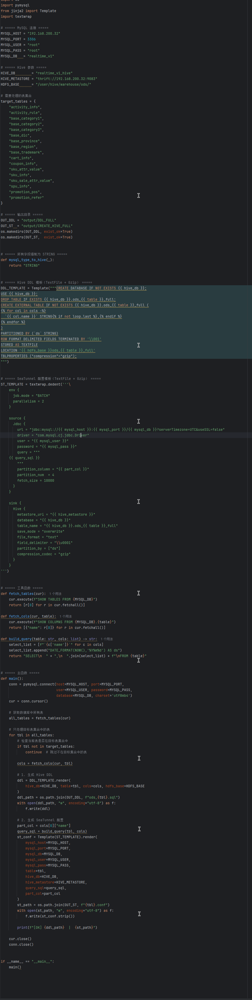
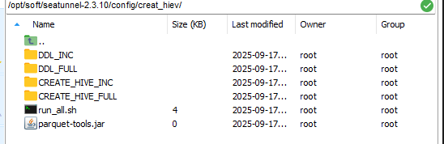
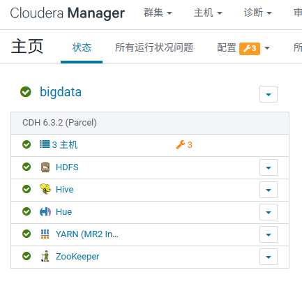
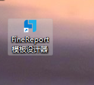

# offline_v1
offline_v1
--houjiaxing
-- 2025-09-13
--cdh uI

--Hive远程连接

# offline_v1
--offline_v1
-- 2025-09-15
--houjiaxing

seatunnel跑通了

# offline_v1
--offline_v1
-- 2025-09-15
--houjiaxing
创建Hive

# offline_v1

--offline_v1

-- 2025-09-16

--houjiaxing

mysql到hive数据同步成功

写了mysql到seatunnel的数据同步的脚本

# offline_v1

--offline_v1

-- 2025-09-17

--houjiaxing

修改了脚本设置了full表脚本

修改了脚本设置了inc表脚本

执行脚本生成的然后自己写了一个脚本

# offline_v1

--offline_v1

-- 2025-09-18

--houjiaxing

在cdh上添加Hue也能正常使用

# offline_v1

--offline_v1

-- 2025-09-19

--houjiaxing

数仓项目写完了但是ads有好多表没数据，然后从新生成数据
下载完conda能正常用
下载Finereport和添加驱动也能连接mysql做报表

# offline_v1

--安装maven

-- 2025-09-23

--houjiaxing

今天写flink cdc一直报依赖的错误，后来修改好的但是代码的执行非常慢作了许多优化

但是还是没用，来后我重新下载了idear和maven

# offline_v1

--安装maven

-- 2025-09-24

--houjiaxing

今天maven配置好了依赖能正常解析了，然后flink cdc 跑通了，后面写pyspark报错，说没有hadoop环境后来重新下载配置环境变量，但是执行还是报错没有hadoop问AI然后解决了问题

pyspark dim的创建

能执行但是表里没数据

