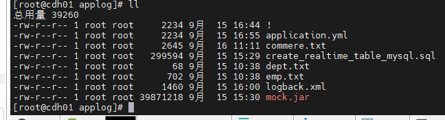

# offline_v1
offline_v1
--houjiaxing
-- 2025-09-13
--cdh uI

--Hive远程连接

# offline_v1
--offline_v1
-- 2025-09-15
--houjiaxing

seatunnel跑通了

# offline_v1
--offline_v1
-- 2025-09-15
--houjiaxing
创建Hive

# offline_v1

--offline_v1

-- 2025-09-16

--houjiaxing

mysql到hive数据同步成功

写了mysql到seatunnel的数据同步的脚本

# offline_v1

--offline_v1

-- 2025-09-17

--houjiaxing

修改了脚本设置了full表脚本

修改了脚本设置了inc表脚本

执行脚本生成的然后自己写了一个脚本

# offline_v1

--offline_v1

-- 2025-09-18

--houjiaxing

在cdh上添加Hue也能正常使用

